# Agentic Multi-Hop RAG

**Live Portfolio:** https://agentic-multi-hop-rag.vercel.app

A cost-aware retrieval-augmented generation system benchmarked on
[MultiHop-RAG](https://github.com/yixuantt/MultiHop-RAG) (Tang & Yang, 2024,
COLM 2024). The main system, **Agentic Multi-Hop RAG**, iteratively retrieves
missing evidence across up to three hops before answering. **Adaptive RAG** is
a cost-optimized variant that routes each question through the cheapest
retrieval strategy a learned classifier judges sufficient, falling back to the
full agentic loop only when needed.

Agentic Multi-Hop RAG is compared against four baselines — Dense RAG,
Hybrid RAG, Hybrid + Reranker, and Adaptive RAG — on answer quality,
evidence coverage, cost, and latency, measured on a development sample and,
once, on a one-time final holdout evaluation.

**In short:** on development questions genuinely resolved through
iteration, mean evidence coverage rose **63.2% → 75.7% → 81.5%** across
Baseline → Context-Matched (a controlled, same-evidence-volume baseline) →
Agentic — see the case study in §15 for the controlled comparison, the
mechanism evidence, and worked examples with real recovered queries.

**Stack:** Python · Qdrant (hybrid dense + BM25 retrieval) ·
`BAAI/bge-base-en-v1.5` (dense embeddings) · `BAAI/bge-reranker-base`
(cross-encoder reranking) · `zai.glm-4.7-flash` (agent controller) ·
`qwen.qwen3-next-80b-a3b-instruct` (generation) · scikit-learn (learned
Adaptive router) · FastAPI + Next.js (live demo).

## 1. Problem

Single-pass RAG retrieves once and generates once. That works when one
retrieval call surfaces all the evidence a question needs, but MultiHop-RAG's
questions are deliberately constructed to require evidence spread across 2–4
separate source documents — comparison, temporal, and inference questions
that no single query reliably retrieves in one pass. A single-pass system
either misses evidence silently or has no mechanism to notice and correct it.

## 2. Business use case

Any RAG system answering questions that may require synthesizing multiple
sources — cross-document comparison, timeline reconstruction, multi-fact
inference — faces the same failure mode as a one-shot vector search: it
returns a confident-sounding but under-evidenced answer instead of noticing
it needs to look further. An agentic system that can iteratively retrieve,
judge sufficiency, and only then answer directly addresses that failure mode;
a cost-aware router on top of it addresses the natural follow-up business
question — "do we need the expensive agentic loop for every query, or only
the ones that actually require it?" — with a measured, not assumed, answer.

## 3. Architecture

```mermaid
flowchart TD
    subgraph Baselines["Baselines: single-pass, no iteration"]
        direction LR
        BQ1["Question"] --> BD["Dense Retrieval"] --> BA1["Qwen Answer"]
        BQ2["Question"] --> BH["Hybrid Dense + BM25, RRF k=60"] --> BA2["Qwen Answer"]
        BQ3["Question"] --> BR["Hybrid + Cross-Encoder Reranker"] --> BA3["Qwen Answer"]
    end

    subgraph Agentic["Agentic Multi-Hop RAG: main system"]
        AQ["Question"] --> AH["Hybrid Dense + BM25 Retrieval"]
        AH --> ARRF["Reciprocal Rank Fusion, k=60"]
        ARRF --> AR["Cross-Encoder Reranking, hop 1"]
        AR --> AC{"Evidence Sufficiency, GLM Controller"}
        AC -->|"Insufficient, hops < 3"| AF["Targeted follow-up retrieval"]
        AF --> AH
        AC -->|"Sufficient, or 3 hops reached, or budget/timeout"| AA["Final answer generation, Qwen"]
    end

    subgraph AdaptiveRAG["Adaptive RAG: learned cost-aware router"]
        DQ["Question"] --> DH["Hybrid Retrieval"]
        DH --> DS1{"Stage 1 router, tau = 0.63"}
        DS1 -->|"SIMPLE"| DA1["Qwen Answer, Hybrid top-5"]
        DS1 -->|"escalate"| DR["Cross-Encoder Reranker"]
        DR --> DS2{"Stage 2 router, tau = 0.70"}
        DS2 -->|"MEDIUM"| DA2["Qwen Answer, reranked top-5"]
        DS2 -->|"COMPLEX"| DAG["Bounded agentic loop, reuses hop-1 retrieval"]
        DAG --> DA3["Qwen final answer"]
    end
```

Every path — baseline, agentic, or adaptive — ends at the same frozen
generation call: `qwen.qwen3-next-80b-a3b-instruct`, same prompt version,
same context-assembly logic, same pricing. Only what evidence reaches that
call differs. The agentic controller (`zai.glm-4.7-flash`) makes exactly one
structured decision per hop: is the evidence sufficient, and if not, what's
the next focused query. The Adaptive router (two `scikit-learn
LogisticRegression` models, `τ1=0.63`/`τ2=0.70`, fit on retrieval/rerank
diagnostics only) makes that same kind of decision with zero LLM calls and
sub-millisecond latency — see §6.

## 4. Dataset

[`yixuantt/MultiHopRAG`](https://huggingface.co/datasets/yixuantt/MultiHopRAG)
— 609 news documents (`corpus.json`) and 2,556 multi-hop QA pairs
(`MultiHopRAG.json`), each labeled `question_type`
(`inference_query` / `comparison_query` / `temporal_query` / `null_query`)
and citing 0–4 supporting source documents.

Three disjoint-by-construction splits, stratified by `question_type`,
seeded deterministically:

| Split | Source pool | Size | Seed |
|---|---|---|---|
| `development` | full QA population | 300 | 42 |
| `final_holdout` | population minus `development` | 300 | 123 |
| `smoke` | `development` only | 40 | 7 |

`final_holdout` is sampled only from what's left after removing
`development`, so overlap is structurally impossible. Ground-truth
`answer`/`evidence_list` are loaded and preserved strictly for offline
evaluation — never passed to retrieval, routing, the agent, or generation.

## 5. Baselines

Agentic Multi-Hop RAG is measured against four baselines: **1. Dense RAG**,
**2. Hybrid RAG**, **3. Hybrid + Reranker**, and **4. Adaptive RAG** (§6) —
a cost-optimized router-based alternative to the main system, not a
single-pass method itself.

Retrieval quality on the 265 non-null **development** questions
(`results/retrieval_eval_development.json`):

| Method | Recall@10 | Hit@10 | MRR@10 | NDCG@10 | Complete-Evidence@10 |
|---|---|---|---|---|---|
| Dense (`BAAI/bge-base-en-v1.5`) | 77.4% | 98.9% | 0.681 | 0.621 | 52.5% |
| Hybrid (Dense + BM25, RRF k=60) | 84.1% | 99.6% | 0.758 | 0.701 | 62.3% |
| Hybrid + Reranker (`BAAI/bge-reranker-base`) | 82.6% | 99.6% | 0.795 | 0.729 | 60.8% |

Hybrid improves over Dense alone; the reranker trades a little Recall@10 (its
fixed 20-candidate depth can't recover evidence RRF never surfaced) for
better top-of-ranking precision (MRR@10/NDCG@10 both improve).

## 6. Agentic Multi-Hop RAG design

The main system runs a bounded loop (`mhrag.agent.loop`), hard-limited in
code, never only by a prompt:

- **Max 3 retrieval calls** (hop 1 + up to 2 follow-ups) — a bounded `for`
  loop, structurally incapable of exceeding this regardless of what the
  controller returns.
- **Context token budget** (4,500 tokens, checked after every hop) and a
  **wall-clock timeout**, both stopping the loop before either is exceeded.
- **Duplicate follow-up queries rejected** before a repeat retrieval call.
- One structured LLM call per hop (`zai.glm-4.7-flash`, JSON-schema strict
  mode, defensively re-validated field by field): `{sufficient, next_query,
  reason}`. On any call failure or invalid response, the loop stops with a
  distinct `stop_reason="controller_failure"` rather than guessing.
- Evidence is deduplicated by chunk id across hops and merged in
  hop-then-rank order (never re-sorted by score across hops, since each
  hop's relevance score is scoped to that hop's own query).

**Adaptive RAG** (`mhrag.adaptive.pipeline`) wraps the same frozen retrieval,
reranking, and agentic-loop code behind a two-stage learned router:

- **Stage 1** (after Hybrid RRF): a logistic regression on 19 query/retrieval
  diagnostic features (no gold labels, no LLM call) predicts
  `HYBRID_SUFFICIENT`; threshold **τ1 = 0.63**.
- **Stage 2** (after reranking, only if Stage 1 escalates): a second logistic
  regression on 26 features (Stage 1's plus 7 reranker/rank-change signals)
  predicts `RERANK_SUFFICIENT`; threshold **τ2 = 0.70**.
- If Stage 2 also escalates, the question is routed **COMPLEX** into the
  exact same bounded agentic loop above — critically, **reusing** the
  Hybrid+Reranker result already computed for the Stage 2 decision as hop 1,
  rather than repeating that retrieval call.
- Both thresholds were chosen from 5-fold cross-validated out-of-fold
  probabilities only (never the final model's own training predictions),
  under the constraint **under-routing ≤ 10%**, minimizing projected cost
  among the thresholds that satisfy it, with ties broken toward the more
  conservative (escalate-when-uncertain) pair. Realized under-routing on
  cross-validation: **9.8%**; COMPLEX recall: **84.4%**.
- Strongest Stage 1 signal: `consensus_fraction_top5` (dense/BM25 agreement
  in the top-5, coefficient −0.87 — lower cross-method agreement predicts
  escalation). Strongest Stage 2 signal: `rerank_score_gap_top1_top5`
  (coefficient +0.72 — a confident, well-separated top result predicts
  sufficiency).
- The router itself makes **zero LLM calls** and adds **sub-millisecond**
  decision latency — it is pure standardize → dot-product → sigmoid
  arithmetic over a frozen, JSON-serializable linear model, verified
  numerically identical to real `scikit-learn` `predict_proba` to <1e-9.

## 7. Evaluation methodology

**Answer generation** for every pipeline uses the identical Qwen model,
prompt version, context-assembly logic, and pricing — only the retrieved
evidence differs between pipelines.

**Deterministic metrics** (`mhrag.eval.answer_metrics`): SQuAD-style
normalized Exact Match and token F1 (MultiHop-RAG's own official evaluation
scores retrieval only — Hits@K/MAP@10/MRR@10 against evidence facts — so
these are the project's own standard-QA-literature extension for the answer
layer, applied on top of retrieval that already follows the official
metric definitions). For `null_query`, correctness is redefined as
**correct abstention** — the answer states the context is insufficient
(phrase-matched against the documented list in `ABSTENTION_PHRASES`,
consistent with the generation prompt's explicit instruction to say so
rather than guess).

**LLM-as-judge**, for open-ended (non-null) answers only: a fixed 3-level
rubric (`correct` / `partially_correct` / `incorrect` → 1.0 / 0.5 / 0.0),
temperature 0, run by `openai.gpt-oss-120b` — a **third** model, distinct
from both the answer-generation model (Qwen) and the agent controller (GLM),
so judging never grades a model's own output or shares a model with a
routing decision. The judge's input is deliberately minimal: question,
reference answer, candidate answer — never the pipeline name, route, or
model that produced the candidate, so it cannot be biased by knowing which
system it's grading. **Judge cost/latency/tokens are tracked completely
separately from pipeline operational cost, never merged into one number.**
Judge configuration was frozen and validated on a small sample (31 cases —
5 synthetic sanity checks plus 26 real answers) before every full run;
validation caught and fixed a real, reproducible structured-output glitch
specific to `openai.gpt-oss-120b` (a duplicated leading `{`) before it could
silently fail ~90%+ of judge calls.

**Combined quality score** (used for the headline retention comparison)
blends the judge score for non-null questions with abstention-correctness
for null questions into one 0–1 number per pipeline per question.

**Sampling**: development and final-holdout evaluation each use a fixed
**50-question** sample, two-level stratified — first by `question_type`
proportional to population share, then by hop-count (2/3/4, where
applicable; `null_query` is its own stratum) — seeded deterministically
(`seed=2029`) with the exact same method and seed applied to both
populations, so there's no appearance of seed-shopping for a favorable
sample.

**Final holdout integrity**: every model id, retrieval config, router
threshold/weight, agent config, and prompt template file was SHA-1 hashed
into a manifest **before** `final_holdout.json` was read for the first
time. The aggregation step re-hashes the same file list and would raise
if a single byte had changed — mechanically proving, not just claiming, that
nothing was tuned between freezing and finishing. `final_holdout.json` is
now marked **consumed** (`results/final_holdout_consumed.json`) and is not
evaluated against again.

## 8. Development results (50-question stratified sample)

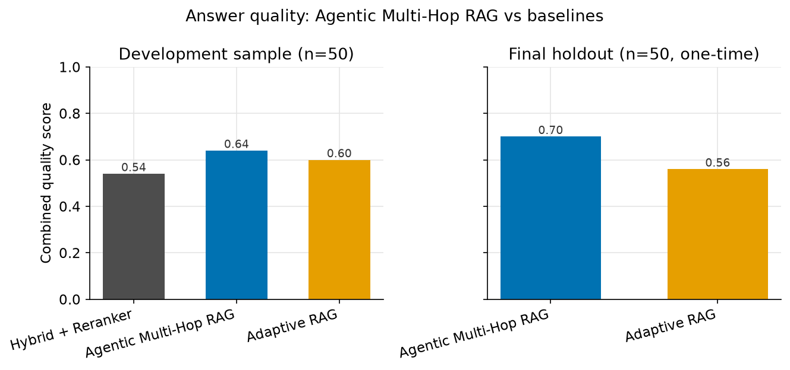

| Pipeline | Combined quality | Judge: correct/incorrect | Evidence coverage | EM | Token F1 |
|---|---|---|---|---|---|
| Hybrid + Reranker | 0.540 | 21 / 23 | 68.4% | 0.000 | 0.020 |
| **Agentic Multi-Hop RAG** | **0.640** | 26 / 18 | **81.1%** | 0.000 | 0.022 |
| **Adaptive RAG** | **0.600** | 24 / 20 | 77.5% | 0.000 | 0.024 |

Adaptive quality retention vs Agentic: **93.75%**. Null-query abstention:
**100%** for every pipeline (6/6). Normalized EM is ~0 across the board —
expected, since MultiHop-RAG gold answers are explanatory sentences, not
short spans; token F1 and the judge score carry the real signal.

Adaptive's route mix on this sample: 26% SIMPLE, 4% MEDIUM, 70% COMPLEX —
consistent with the router's overall population-level rate (~72% COMPLEX),
confirming this sample is representative rather than favorable.

## 9. Final holdout results (one-time, 50-question stratified sample)

(Right-hand panel of the answer-quality chart in §8.)

| Metric | Agentic Multi-Hop RAG | Adaptive RAG |
|---|---|---|
| Combined quality | **0.700** | 0.560 |
| Evidence coverage | **75.9%** | 68.0% |
| Cost/query | $0.001159 | **$0.000907** |
| Latency/query | 9,660 ms | **7,573 ms** |
| Null-query abstention | 100% (6/6) | 100% (6/6) |

**Adaptive quality retention vs Agentic: 80.0%. Cost reduction: 21.8%.
Latency reduction: 21.6%.**

**Honest framing:** Agentic Multi-Hop RAG achieved higher answer quality and
evidence coverage, while Adaptive RAG reduced cost and latency at a
measurable quality trade-off. The trade-off is real and worth stating
plainly, not smoothed over — retention was noticeably lower on holdout
(80.0%) than on development (93.75%; see §10), so this is a genuine
generalization finding, not an artifact of one sample.

Judge fallback rate: 3/88 calls (3.4%) — sensitivity-checked by dropping the
fallback questions entirely (rather than scoring them conservative-0)
instead of treating them as "incorrect": combined quality becomes 0.729
(Agentic, n=48) / 0.571 (Adaptive, n=49), retention **78.4%** — within 1.6
points of the reported 80.0%. The headline conclusion — a real, ~20-point
quality gap — is unaffected by how the 3 fallback calls are treated.

## 10. Cost/latency trade-off

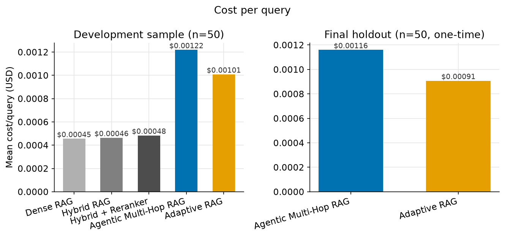
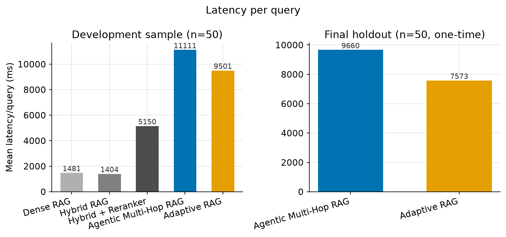
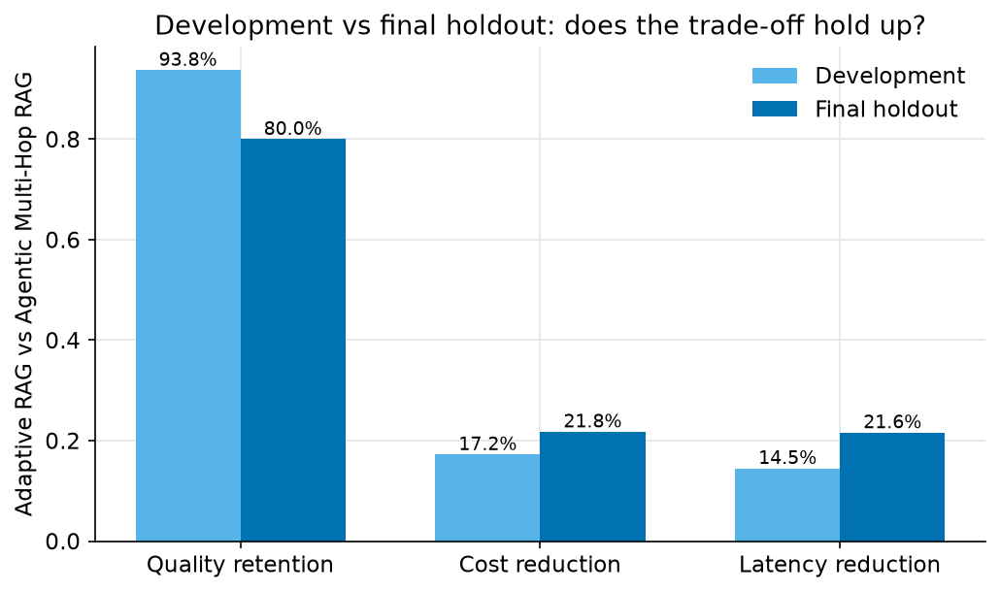

| | Development | Final holdout |
|---|---|---|
| Quality retention | 93.75% | 80.00% |
| Cost reduction | 17.2% | 21.8% |
| Latency reduction | 14.5% | 21.6% |

Cost/latency savings were *larger* on holdout than development, while
quality retention was *lower* — Adaptive saves more but gives up more to do
it on unseen data. Both numbers moving in the same direction (larger
savings, larger quality gap) rather than one improving and one worsening is
itself informative: it's consistent with the router escalating slightly
less aggressively on this split rather than with noisy, unrelated swings in
two unrelated metrics.

Router decision cost itself is $0 marginal and sub-millisecond regardless of
split — every dollar/millisecond in the Adaptive numbers above comes from
which backend (Hybrid-only / Hybrid+Reranker / full agentic loop) each
question was routed to, not from the routing decision itself.

## 11. Failure analysis

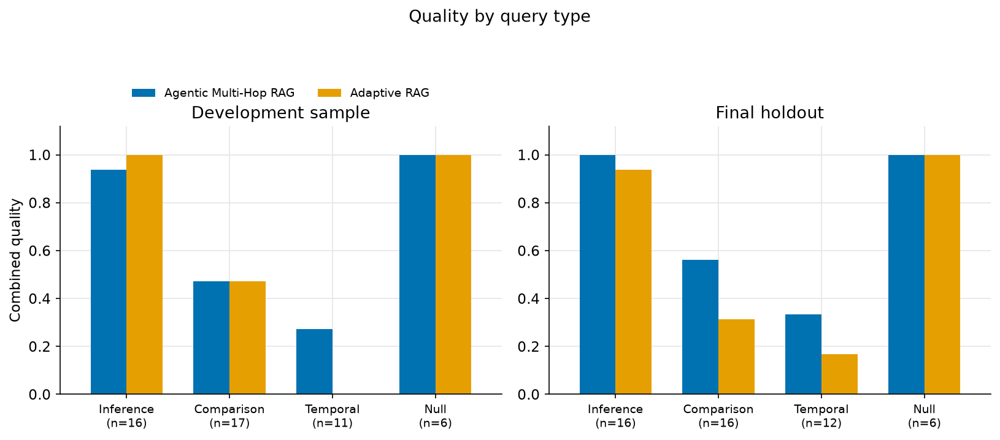
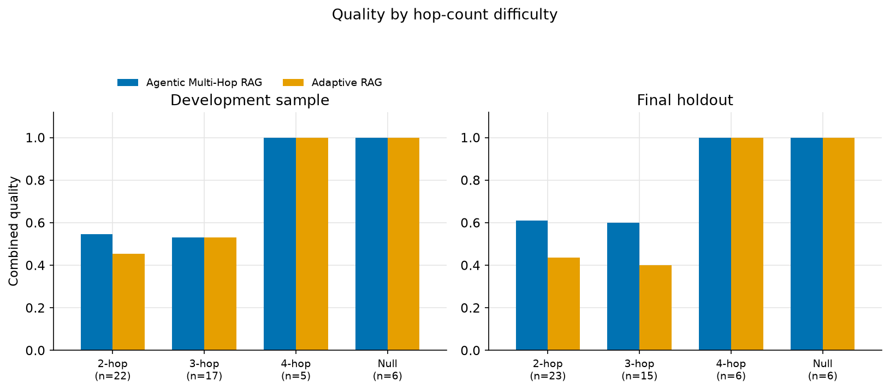

**Comparison and temporal questions are this system's clearest weakness**,
on both pipelines, on both splits:

| Query type | Dev: Agentic | Dev: Adaptive | Holdout: Agentic | Holdout: Adaptive |
|---|---|---|---|---|
| Inference | 0.938 | 1.000 | 1.000 | 0.938 |
| Comparison | 0.471 | 0.471 | 0.563 | 0.313 |
| **Temporal** | **0.273** | **0.000** | **0.333** | **0.167** |
| Null | 1.000 | 1.000 | 1.000 | 1.000 |

Temporal questions are the weakest category for both systems on both
splits — well below inference and null-query performance, and Adaptive
loses noticeably more ground than Agentic specifically here (0.000 vs 0.273
on dev; 0.167 vs 0.333 on holdout). Comparison questions are the second
weakest category and show the same pattern: Adaptive trails Agentic by a
visible margin on holdout (0.313 vs 0.563). Inference and null questions are
comparatively strong for both systems (≥93.8%). Hop-count breakdown shows no
clean monotonic difficulty gradient — 4-hop questions score *highest* on
both splits (likely because MultiHop-RAG's 4-hop inference questions happen
to have more redundant, easier-to-find evidence than its 2/3-hop
comparison/temporal questions, not because more hops are inherently easier).

**Adaptive under-routing failures**: 5/44 on development, 10/44 on holdout —
in both cases concentrated in comparison_query and temporal_query, nearly
all routed SIMPLE with reduced evidence coverage relative to what Agentic
found. This is the router paying its "cheap route" bet and losing on
exactly the two categories already flagged above as globally weak — not a
new, separate failure mode.

## 12. Limitations

- **Small evaluation samples.** 50 questions per split is enough to see a
  clear, consistent signal (temporal/comparison weakness, a real quality
  gap that doesn't flip under judge-fallback sensitivity analysis) but not
  enough for tight confidence intervals on any single percentage.
- **MEDIUM is a rare, hard-to-hit router class** — the router predicts it
  for only ~2–4% of questions; its own precision/recall on that class is
  weaker than SIMPLE/COMPLEX (see Phase 8A.2 router report), a direct
  consequence of the conservative, safety-first threshold objective.
- **Judge fallback rate (~3%)** means a small fraction of judge verdicts are
  the conservative default (`incorrect`) rather than a real grade — reported
  explicitly, sensitivity-checked, and does not change the headline finding,
  but is a real source of noise, not zero.
- **Temporal and comparison questions remain unresolved weaknesses** for
  both the main agentic system and the router — not something the router
  compensates for; if anything, the router degrades further on exactly
  these categories.
- **EM/token-F1 are close to uninformative** for this dataset's explanatory
  gold answers; the judge score and evidence coverage carry the real
  quality signal, and both depend on judge-model behavior that was
  validated but not independently cross-checked against a second judge
  model.
- **The final holdout evaluation is one-time by design** — these numbers
  cannot be improved by further tuning without invalidating the entire
  held-out measurement; the manifest/consumed-marker mechanism exists
  specifically to make that discipline verifiable, not just declared.

## 13. Reproducibility

- Every retrieval/router/agent/generation module is deterministic given its
  frozen inputs — no sampling temperature above 0 anywhere in the pipeline,
  fixed RRF tie-breaks, fixed CV seed (42) for router training, fixed
  stratified-sampling seed (2029) for both evaluation samples.
- Every live (paid) script checkpoints after every single question and
  resumes from an existing checkpoint without repeating a completed call —
  verified live: partial runs were interrupted and resumed multiple times
  during this project with zero duplicate Mantle calls.
- The final holdout evaluation's pre-access configuration manifest
  (`results/final_evaluation_manifest.json`) hashes 29 files; the
  aggregation script re-hashes and would raise on any drift — this is
  mechanically checked, not just asserted in prose.
- All reported numbers come from artifacts committed under `results/` —
  every chart in this README was generated from those same files by
  `scripts/generate_phase9_charts.py`, with no manual number entry.

## 14. How to run

```bash
# Setup
python3 -m venv .venv && source .venv/bin/activate
pip install -e ".[dev]"
cp .env.example .env   # fill in $OPENAI_API_KEY / $MANTLE_BASE_URL for any LIVE script
docker compose up -d   # local Qdrant, http://localhost:6333

# Build the dataset splits, corpus index, and hybrid (BM25) index
python scripts/download_dataset.py
python scripts/build_benchmark.py
python scripts/build_index.py
python scripts/build_hybrid_index.py

# Retrieval-only baselines (development split, no LLM cost)
python scripts/run_retrieval_eval.py

# The learned Adaptive router is already frozen at results/learned_router_model.json
# (tau1=0.63, tau2=0.70) — retraining it is scripts/train_learned_router.py, not run
# by default since this README's numbers depend on the frozen thresholds staying fixed.

# Development-sample benchmark (50 questions x 5 pipelines) — LIVE, real (small) Mantle cost
python scripts/select_phase9_sample.py
python scripts/run_phase9_benchmark.py --pipeline dense
python scripts/run_phase9_benchmark.py --pipeline hybrid
python scripts/run_phase9_benchmark.py --pipeline hybrid_reranker
python scripts/run_phase9_benchmark.py --pipeline agentic_multi_hop
python scripts/run_phase9_benchmark.py --pipeline adaptive_rag
python scripts/run_phase9_judge.py --pipeline hybrid_reranker
python scripts/run_phase9_judge.py --pipeline agentic_multi_hop
python scripts/run_phase9_judge.py --pipeline adaptive_rag
python scripts/analyze_phase9_sample.py

# Final holdout — ALREADY RUN AND CONSUMED (results/final_holdout_consumed.json).
# Shown here for reference only; do not re-run against the same holdout file.
python scripts/freeze_final_evaluation_manifest.py
python scripts/select_phase9_holdout_sample.py
python scripts/run_phase9_holdout_benchmark.py --pipeline agentic_multi_hop
python scripts/run_phase9_holdout_benchmark.py --pipeline adaptive_rag
python scripts/run_phase9_holdout_judge.py --pipeline agentic_multi_hop
python scripts/run_phase9_holdout_judge.py --pipeline adaptive_rag
python scripts/analyze_phase9_holdout.py
python scripts/mark_final_holdout_consumed.py

# Regenerate this README's charts from the committed result artifacts
pip install -e ".[viz]"
python scripts/generate_phase9_charts.py

# Full test suite (offline unit tests + live-service integration tests;
# embedding/Qdrant tests skip gracefully if unavailable)
pytest
```

Config is split across `configs/dataset.yaml` (splits/seeds),
`configs/retrieval.yaml` (Qdrant, embedding, chunking, reranker),
`configs/mantle.yaml` (final-answer model/pricing), `configs/agent.yaml`
(controller/loop/pricing), `configs/judge.yaml` (frozen judge model/rubric
version), and `configs/models.yaml` (fixed model-id decisions).

## 15. Case study — why iterative retrieval earns its cost

A single retrieval pass either finds everything a question needs or it
doesn't — and has no way to notice which. The agentic controller's job is
exactly that noticing: after every hop it judges whether the evidence
gathered so far is sufficient, and if not, issues one focused follow-up
query aimed at what's missing. On the subset of development questions this
project can trace end to end — where hop 1 alone genuinely wasn't enough —
that mechanism visibly earns its keep.

The general mechanism, independent of any one question:

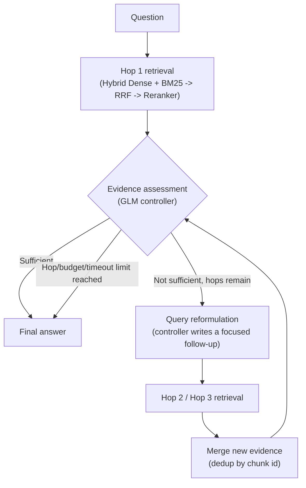

One concrete instance of that flow, from the evaluated development set:

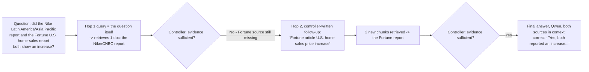

*(qa_id `23e249aa926b8fda` — the actual recovered hop-2 query and evidence
for this question; full trace in Example 1 below.)*

### Baseline vs. Context-Matched vs. Agentic

Three pipelines are compared, deliberately isolating *how much evidence*
from *how it was found*:

| Pipeline | What it does |
|---|---|
| **Baseline (Hybrid + Reranker)** | One retrieval pass, top-5 chunks, no iteration — §5/§6. |
| **Context-Matched (control)** | The *same* single-pass retrieval, but given as many chunks as Agentic actually ended up using for that specific question — isolates whether an advantage is just "more context" rather than the iteration itself. |
| **Agentic Multi-Hop (all hops)** | Up to 3 retrieval hops; the controller decides after each one whether to stop or issue a new, targeted query; evidence is deduplicated and merged across hops before generation. |

Because Context-Matched already controls for evidence *volume*, any
remaining Agentic advantage over it is attributable to *which* evidence
iteration found — not simply how much of it there was.

### Results: evidence coverage on genuinely multi-hop-resolved questions

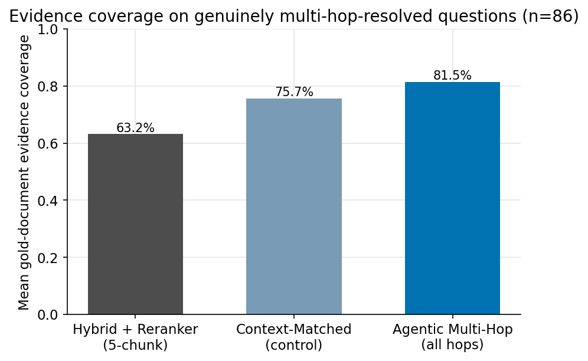

Measured on the 86 development questions where Agentic actually took more
than one hop and all three pipelines have a result to compare
(`results/multihop_success_analysis.json`):

> **63.2% → 75.7% → 81.5%**
> Baseline → Context-Matched (same evidence volume, no iteration) → Agentic Multi-Hop (iterative retrieval)

| Pipeline | Mean evidence coverage | vs. Baseline | vs. Context-Matched |
|---|---|---|---|
| Baseline (Hybrid + Reranker) | 63.2% | — | — |
| Context-Matched (control) | 75.7% | +12.5 pp | — |
| **Agentic Multi-Hop (all hops)** | **81.5%** | **+18.3 pp** | **+5.8 pp** |

**Mechanism evidence:** of the 92 questions Agentic resolved in 2+ hops, a
later hop retrieved a required (gold) document that hop 1 had missed in
**33 cases (35.9%)** — later hops recovered previously missing required
evidence in roughly a third of genuinely multi-hop questions.

**Strongest outcome:** of those 33, Agentic went on to produce a
correctly-graded answer where *both* Baseline and Context-Matched were
graded incorrect in **7 cases** total
(`results/multihop_success_analysis.json`'s
`final_judge_outcome_breakdown.beats_both_baselines`). One of those 7
(`qa_id 03ea05f6e99ffb38`) is excluded from the worked-examples selection
below only — a known Task Success evaluator-grade quirk, documented in the
same artifact's `excluded_qa_ids` field — leaving **6 (18.2% of 33)** used
for examples. Both numbers are reported so the 7→6 reduction is explicit
and reproducible, not a silent discrepancy: a real, traceable, but partial
conversion rate either way — finding the missing evidence is necessary but
not sufficient for a better final answer, and that gap is reported here
rather than smoothed over (see Limitations below).

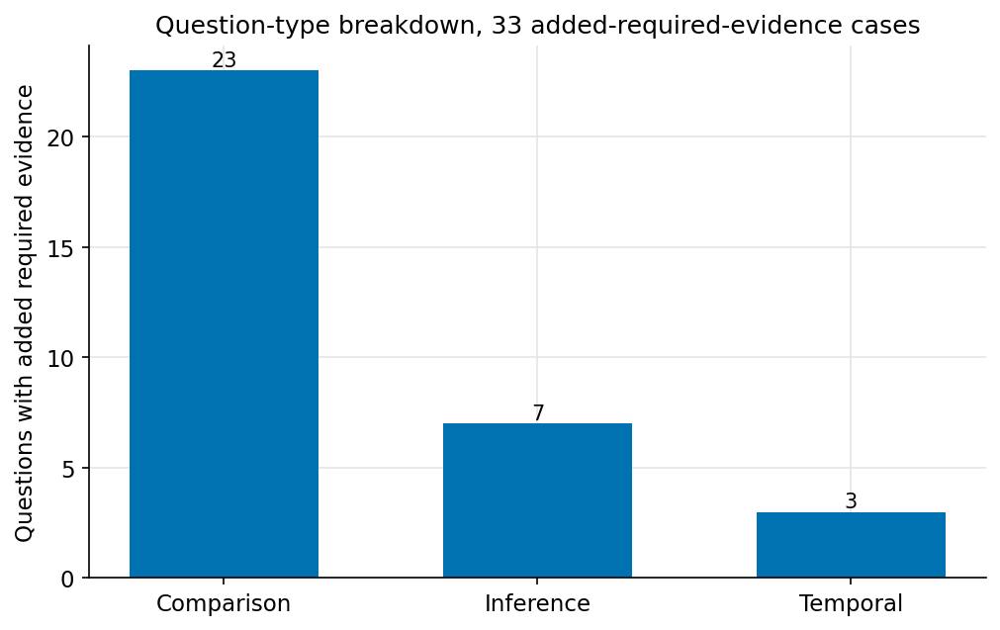

### Three worked examples

Each trace below combines the original benchmark run with a **live,
independent replay** of that exact question (`scripts/replay_multihop_examples.py`,
development split only), which recovered the actual verbatim hop-2/hop-3
queries — the original benchmark script never persisted them, only the
final aggregate result.

**1. `23e249aa926b8fda` — comparison, stopped `evidence_sufficient`**
- **Question**: *"Did the report from CNBC on Nike's Latin America and
  Asia Pacific unit and the article from Fortune on the U.S. home sales
  price both report an increase in their respective financial figures?"*
- **Hop 1** (= the question itself) → 1 document (the Nike/CNBC report).
  Missing: the Fortune source entirely.
- **Hop 2** (controller's own follow-up query): *"Fortune article U.S. home
  sales price increase"* → 2 new chunks, the Fortune report.
- **Agentic answer** (correct): *"Yes, the report from CNBC ... sales up 2%
  to $1.57 billion ... The article from Fortune ... existing-home sales
  prices topped $306,000, a 5% increase..."*
- **Baseline (5-chunk) answer** (incorrect): *"...does not include any
  report from CNBC ... nor Fortune..."* — Fortune's document simply never
  made it into a single top-5 pass.

**2. `d04368e192f8096f` — inference, stopped `max_hops`**
- **Question**: *"Which individual, covered by both 'The Verge' and
  'TechCrunch', is implicated in using customer funds for a buyout, faced
  challenges managing two companies due to rapid growth, and is accused of
  committing fraud for personal gain?"*
- **Hop 1** (= the question itself) → 4 documents, none naming the
  individual directly.
- **Hop 2** (controller's follow-up — a plausible but off-target guess):
  *"Monzo CEO Conor Walsh customer funds buyout fraud"* → 3 new chunks,
  which (despite the wrong name) surfaced more of the real FTX material.
- **Hop 3**: *"Conor Walsh Monzo fraud customer funds buyout"* → 1 further
  new chunk before the loop hit its 3-hop limit.
- **Agentic answer** (correct): *"...Sam Bankman-Fried. He directed the use
  of $1 billion in FTX customer funds to buy back FTX shares from
  Binance..."*
- **Baseline (5-chunk) answer** (incorrect): *"...insufficient to
  answer."*
- Worth stating plainly: hop 2's own query named the wrong company — the
  controller doesn't always reformulate accurately — yet the retrieval it
  triggered still recovered the right evidence and the final answer was
  correct. Iteration adding value here did not depend on every intermediate
  step being well-aimed.

**3. `da4c6b17d34d5bb3` — comparison, stopped `token_budget`**
- **Question**: *"Does the TechCrunch article on Meta's advertising
  practices involve the European Commission in a similar capacity to how
  the European Commission is involved in Amazon's iRobot purchase and Elon
  Musk's X company's DSA probe, as reported by TechCrunch in both cases?"*
- **Hop 1** (= the question itself) → 4 documents, missing the
  Amazon/iRobot source.
- **Hop 2**: *"TechCrunch article Amazon iRobot European Commission
  investigation"* → 1 new document, the missing Amazon/iRobot piece.
- **Hop 3**: *"TechCrunch article Meta advertising practices European
  Commission"* → 4 more chunks (mostly reinforcing hop 1's material) before
  the loop's context-token budget was reached.
- **Agentic answer** (correct): identifies the Commission's role as
  structurally comparable across all three cases — Meta (DSA/DMA), X (DSA
  investigation), and Amazon/iRobot (antitrust) — citing specifics for
  each.
- **Baseline (5-chunk) answer** (incorrect): *"...does not mention Amazon's
  acquisition of iRobot."*

All three questions' stop reason, hop count, and final evidence-document
set reproduced exactly in the live replay.

### Limitations of this analysis

- **Iteration finding evidence is not the same as iteration fixing the
  answer.** Only 6 of the 33 questions where a later hop added required
  evidence flipped from "both baselines wrong" to "Agentic correct" — the
  other 27 saw no such clean win. This section deliberately reports both
  numbers, not just the flattering one.
- **Generation is not byte-deterministic.** All 5 replayed questions used
  `temperature=0.0` end to end, and hop count / stop reason / (in 3 of 5
  cases) the final evidence-document set reproduced exactly — but the
  exact wording of every answer differed slightly between the original run
  and the replay, even when the underlying evidence was identical. Hosted
  LLM inference at temperature 0 is not guaranteed to be token-identical
  across separate API calls.
- **Retrieval itself showed minor variation on 2 of the 5 replayed
  questions** — a different chunk was selected at the retrieval boundary,
  most likely because the vector index's approximate nearest-neighbor
  search isn't guaranteed bit-identical across separate live queries. The
  three examples shown above were chosen from the three that reproduced
  exactly; this is disclosed, not hidden.
- **This is a targeted, traceable subset, not the whole system.** The
  86–92 question population above is genuinely multi-hop-resolved
  development questions specifically — it is not the §8/§9 headline
  sample, and these findings should not be read as "Agentic always
  improves the answer" (see the 6/33 conversion rate above).
- **Fact-grounding, where measured elsewhere in this project, is
  retrieval-side only** — whether a required fact reached the generation
  context, not whether the generated answer correctly used it — and is
  intentionally not used as evidence for this section's claims.
- **Development-stage analysis only.** Every number in this section comes
  from the development split; the one-time final holdout evaluation (§9)
  is reported separately and is not part of this case study.

## Project layout

```
configs/            YAML configuration (dataset, retrieval, mantle, agent, judge, models)
data/raw/            Downloaded dataset files — gitignored, regenerate via script
data/processed/      Generated splits + manifest — gitignored except benchmark_manifest.json
src/mhrag/           Package source
  data/              Typed records, sampling, benchmark split construction
  ingestion/          Chunking, dense embedding, BM25 sparse embedding
  retrieval/           Dense / BM25 / RRF / cross-encoder reranking
  routing/              Query/retrieval features, oracle labels, the learned two-stage router
  agent/                 Bounded agentic loop, controller, evidence merge (Agentic Multi-Hop RAG)
  adaptive/                The Adaptive RAG pipeline (frozen router + agentic loop reuse)
  generation/               Mantle client, prompts, context assembly, cost tracing
  eval/                      Answer metrics (EM/F1/abstention), LLM judge, holdout sampling
scripts/              CLI entry points — see "How to run" above
tests/                 Unit tests (offline, fake Mantle/retrieval) + guard tests (structural
                       proof that live scripts can't reach final_holdout, can't leak gold data
                       into a runtime decision) + integration tests (real models + live Qdrant)
results/               Evaluation artifacts (tracked in git) + results/charts/ (this README's images)
```

## Author

RISHIKESH K G — [irishz121212@gmail.com](mailto:irishz121212@gmail.com)
